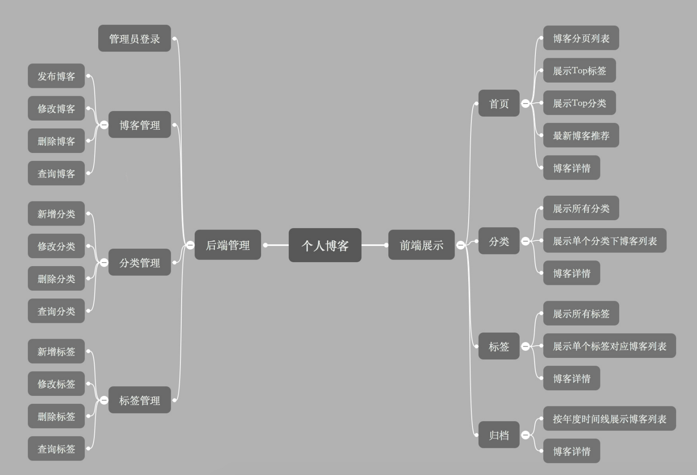
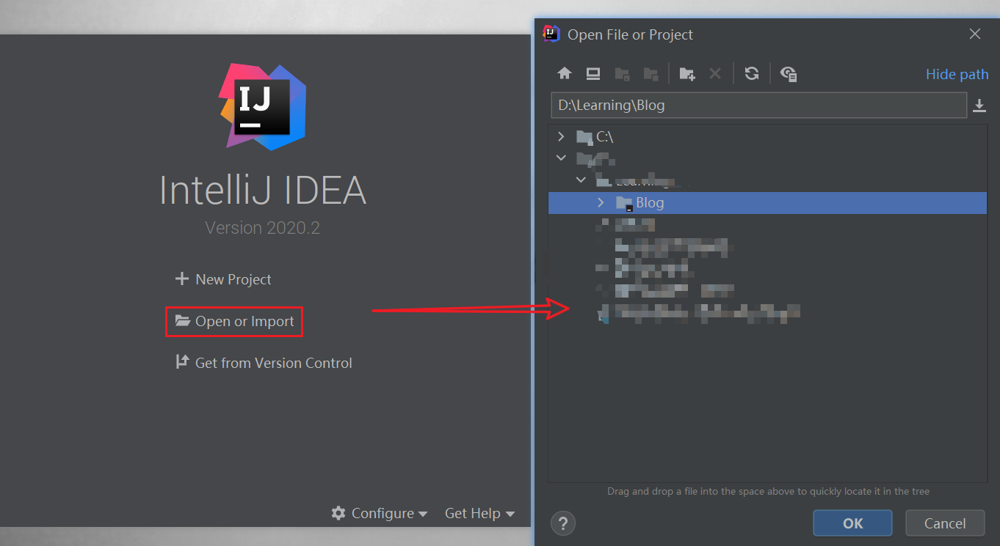
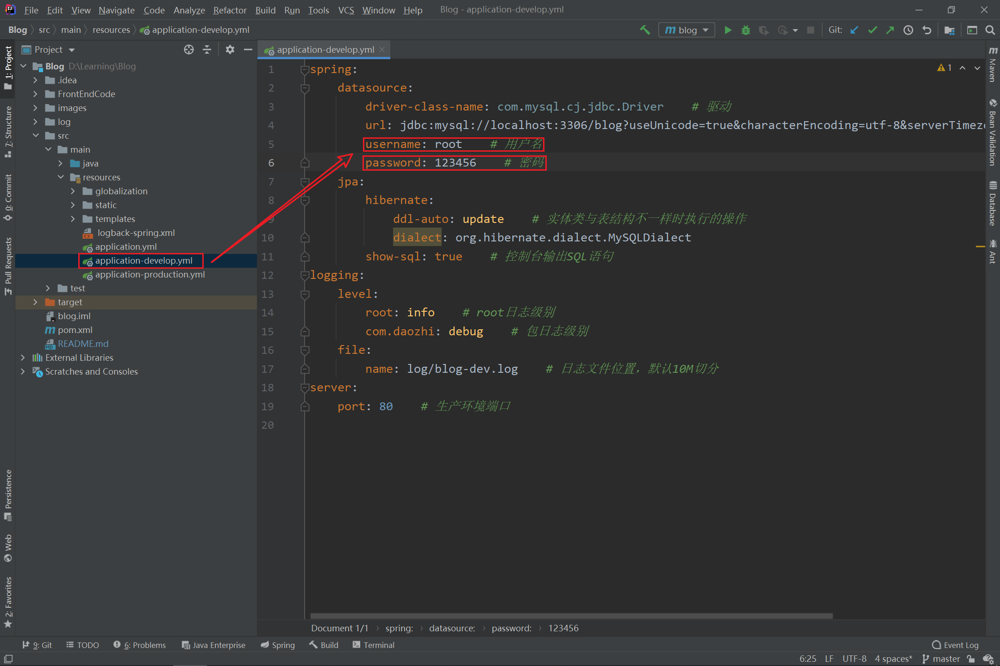
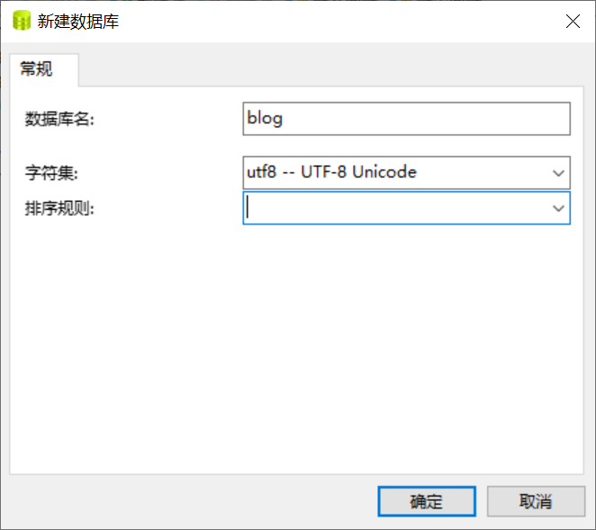
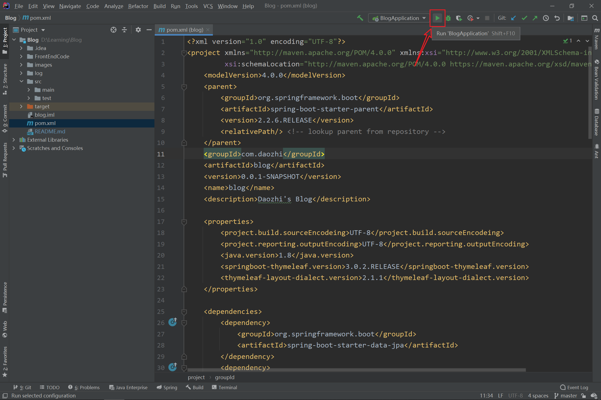

# 我的个人博客源码
## 一、博客博客框架与概述
**博客整体框架：**    

**开发框架**：    
    - 后端：SprintBoot + JPA + thymeleaf模板
    - 数据库：MySQL    
    - 前端：Semantic UI框架    
**开发环境**：    
    - IDEA    
    - Windows 10操作系统
    - JDK 8
    - Maven 3  
**使用的插件：**    
    - 编辑器： Markdown    
    - 内容排版：typo.css    
    - 动画： animate.css    
    - 代码高亮：prism    
    - 目录生成：Tocbot    
    - 滚动侦测：waypoints    
    - 平滑滚动： jquery.scrollTo    
    - 二维码生成： qrcode.js    
**参考的网站：**    
    - 背景：https://www.toptal.com/designers/subtlepatterns    
    - 图片查找：https://unsplash.it    
    - 首图查找：https://picsum.photos/    
    - 编辑器Editor.md：https://pandao.github.io/editor.md/    
    - 内容排版Typo：https://github.com/sofish/typo.css    
    - 动画animate：https://daneden.github.io/animate.css/    
    - 代码高亮prism：https://github.com/PrismJS/prism    
    - 目录生成Tocbot：https://tscanlin.github.io/tocbot/    
    - 滚动侦测waypoints：http://imakewebthings.com/waypoints/    
    - 平滑滚动jquery.scrollTo：https://github.com/flesler/jquery.scrollTo    
    - 二维码生成qrcode.js：https://davidshimjs.github.io/qrcodejs/    
## 二、使用教程
### 第一步 下载
下载源代码，解压到本地文件夹。
### 第二步 导入
导入IDEA开发工具

### 第三步 配置数据库连接

### 第四步 新建数据库

### 第五步 启动工程

启动工程后会自动在连接的数据库中创建数据库表。
### 创建管理员账户
**添加管理员用户SQL语句**：
``` SQL
INSERT INTO `t_user` 
('avatar', 'password', 'update_time', 'id', 'nickname', 'email', 'create_time', 'type', 'username') 
VALUES ('1', 'https://unsplash.it/100/100?image=1005', '2017-11-10 21:06:49', '1725805106@qq.com', '管理员', '96e79218965eb72c92a549dd5a330112', '1', '2019-01-09 07:57:00', 'admin');
```
### 第七步 登录后台
1. 访问http://127.0.0.1/admin访问后台管理页面。    
2. 输入用户名：admin，密码：111111登录系统
3. 进行管理操作。

也可以通过选择maven编译配置生成jar包，这样可以部署到服务器运行。
## 三、联系方式
- 邮箱：daozhixs@gmail.com    
- QQ：1725805106